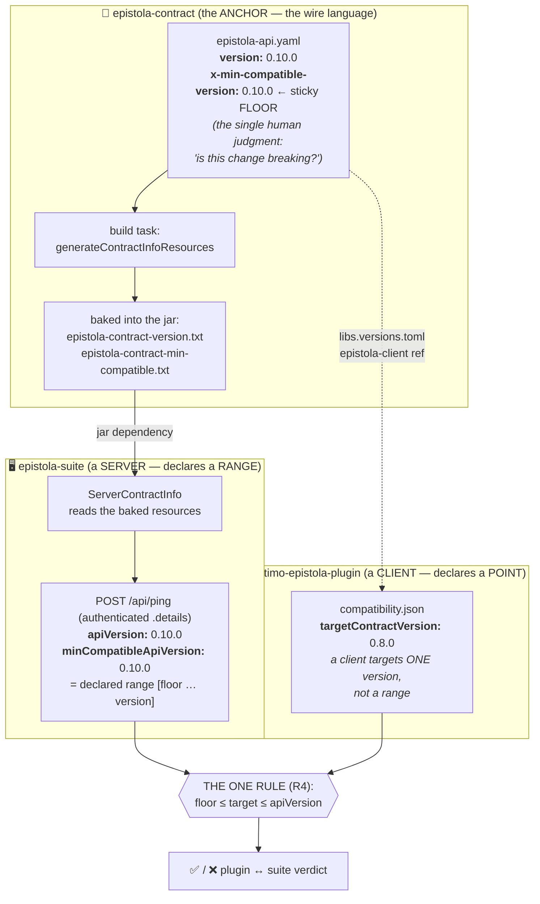
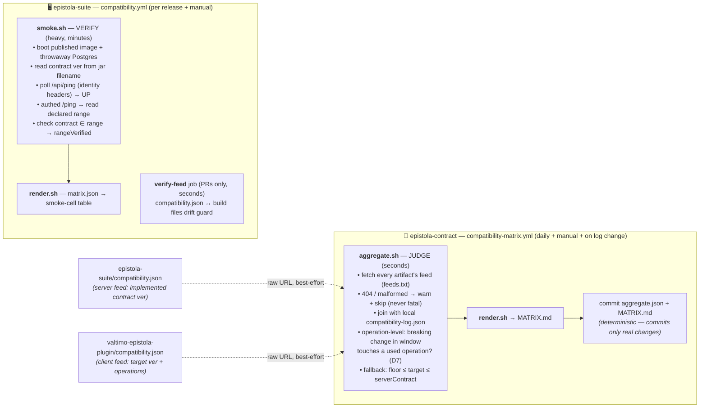
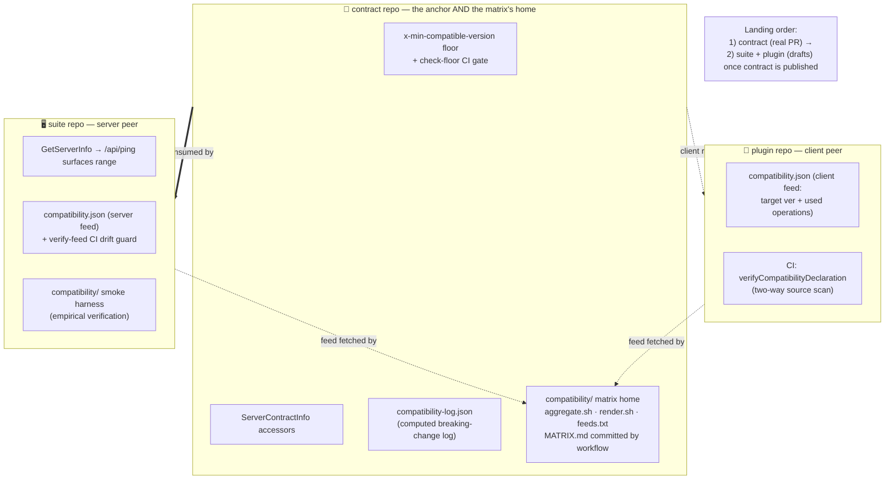

# Compatibility system — requirements & design criteria

Status: the design forks are **decided** (D1–D6 below); the accepted decision is
recorded in [ADR 0011](../docs/adr/0011-version-compatibility-declared-and-verified.md).
This doc is the detailed spec behind that ADR. Companion to
[`README.md`](./README.md) (the current empirical smoke harness) and issue #246.

**Implementation progress:** steps 1–3 are **done and verified end-to-end** — the
contract self-identifies (D1, fixes `apiVersion: "unknown"`), exposes a
compatibility floor (D4), and the suite surfaces the derived accepted range
`[minCompatibleApiVersion … apiVersion]` on `/ping` (D5/D2). Step 4 (harness reads
and verifies that range) is **done — exercised end-to-end** against a locally built
compat-aware image (range verified) and the published `:latest` image (graceful
degradation). Step 5 (**plugin declares** via a committed `compatibility.json` feed),
step 6's **render** (`render.sh` → `MATRIX.md`, in the CI job summary), and step 6's
**aggregate** are all done. **The full pipeline — declare → verify → aggregate →
render — runs end to end in CI** (the aggregate fetches client feeds from
`feeds.txt`).

The system has since been extended to **operation-level verdicts** (D7,
[ADR 0012](../docs/adr/0012-operation-level-compatibility-verdicts.md)): the
contract publishes a machine-computed `compatibility-log.json` (which releases
broke which operations, derived from the tagged spec history with `oasdiff`),
clients additionally declare the `operations` they call (source-verified in
their CI), and the aggregate judges a pairing incompatible only when a breaking
change in the window actually touches an operation the client uses — falling
back to the coarse range rule whenever that join would be unsound. The floor
itself is now CI-gated in the contract repo (`make check-floor`): a breaking
change must move `info.version` and the floor together, and the floor may not
move otherwise. **D6 is resolved**: the matrix's home is the **contract repo**
(`compatibility/` there — a lightweight scheduled workflow judges the feeds
against the log and commits the results), the suite publishes its own server
feed (`compatibility.json`, drift-guarded), and only **verification** (the
smoke, which boots published suite images) stays in the suite. See
[Execution plan](#execution-plan-order).

## How it fits together

Three diagrams, from the idea to the automation. The prose below (roles,
requirements, decisions) is the authority; these are the map.

### 1. The floor-in-the-anchor model

The one human judgment — "is this contract change breaking?" — is made **once**,
in the contract, as the sticky `x-min-compatible-version` floor. Everything
downstream _derives_ from it: the suite (a **server**) surfaces a range
`[floor … version]`, the plugin (a **client**) declares a single target point,
and one rule (`floor ≤ target ≤ apiVersion`, R4) turns those into a verdict. That
is what collapses maintenance from _O(repos × releases)_ to _O(breaking releases)_.

### 2. The CI pipeline — declare → verify → aggregate → render

All four stages run automatically in `compatibility.yml` after an image is
published (or on manual dispatch). The dotted feed fetch is **best-effort**: a
client whose declaration branch has not merged yet (404) is skipped, never fatal.

### 3. Where each piece lives (three repos, one PR each)

Declarations stay **with each artifact** (R8); judging is central, in the
**anchor** (D6 resolved — the contract repo hosts the matrix, so the suite and
external plugins are equal peers). The self-healing part is the dotted feed
arrows: once an artifact's `compatibility.json` is live at its raw URL, the
contract's scheduled matrix workflow picks it up with zero manual steps.

## Why this doc exists (what we learned)

We set out to build an _empirical_ compatibility matrix — boot a published suite
image and observe which contract versions it works with. Building it surfaced a
more fundamental fact:

**The suite has no compatibility contract to observe.** Concretely, verified
this session against real published images:

- It **cannot reliably report the contract version it implements** — `/api/ping`
  returns `apiVersion: "unknown"` because the contract JAR ships without an
  `Implementation-Version` manifest entry. We only recovered the version by
  reading the JAR _filename_ out of the image.
- It **does not declare a supported client range**, anywhere.
- It **does not negotiate or reject** on the client's declared contract version.
  `ClientIdentityFilter` only checks `User-Agent: epistola-contract/<v>` is
  _present and prefixed_ (and only on `/generation/collect`); the version value
  is never compared to anything. Any `epistola-contract/<anything>` is accepted.
- There is exactly **one API version** (`application/vnd.epistola.v1+json`,
  enforced at the media-type layer), decoupled from the contract semver. Nothing
  serves `v2`.

So compatibility today is **implicit and undeclared**. An empirical matrix can
therefore only measure "does it boot and serve" — too shallow to be the answer
#246 wants ("kept **automatically**" implicitly requires that compatibility be
_expressed_; you cannot auto-maintain a fact nothing declares).

**The opportunity:** because no compatibility mechanism exists yet, we are not
retrofitting or reverse-engineering — we get to _design the primitive_ so the
matrix falls out of it cheaply. We're in the RC window, where deliberate,
flagged breaking changes are still allowed, so now is the right time.

## Per-artifact roles (they are NOT uniform)

Compatibility is anchored on **`epistola-contract`** (the wire language the suite
and the external `valtimo-epistola-plugin` both speak). Each artifact plays a
different role:

| Artifact                    | Role                                  | What it must contribute                                                                                                                                                                                                                                                                                                                                                            |
| --------------------------- | ------------------------------------- | ---------------------------------------------------------------------------------------------------------------------------------------------------------------------------------------------------------------------------------------------------------------------------------------------------------------------------------------------------------------------------------- |
| **epistola-contract**       | **Anchor** (not a consumer of itself) | (1) Be **self-identifying** — embed its version so consumers can report it at runtime (fixes `apiVersion: "unknown"`). (2) Embed its **compatibility floor** (`minCompatibleContractVersion`) — the oldest contract version it stays wire-compatible with, bumped only on a breaking change. (3) **Define the declaration format** once, since both suite and plugin depend on it. |
| **epistola-suite**          | **Declarer (derives)**                | Report the contract version it implements **and** an accepted client range — but the range is _derived_ from the anchor's floor + version, not hand-authored. Surface both at runtime (endpoint) and, later, at rest (manifest/feed).                                                                                                                                              |
| **valtimo-epistola-plugin** | **Declarer (external, derives)**      | Report the contract version it targets, in its own published metadata; derives its range from the same anchor-provided floor (separate repo, so it must participate cheaply — deriving keeps it constant-free).                                                                                                                                                                    |
| **Helm charts**             | **Mapping**                           | Declare which suite version they deploy — already done via `appVersion` (informational, decoupled from chart version).                                                                                                                                                                                                                                                             |

The key correction to "every artifact declares the same thing": the **contract's**
contribution is to be readable and to own the _format_; the **consumers** declare
what contract they speak; the **charts** just map to a suite.

## Requirements (what the primitive must provide)

- **R1 — Reliable self-identification.** Any running suite (and ideally any built
  artifact) can truthfully state the contract version it implements, without
  cracking open JAR filenames. (Fixes `apiVersion: "unknown"`.)
- **R2 — Derived support range.** A suite can state the range of client contract
  versions it supports (e.g. `implements 0.10.0, supports clients >= 0.9.0`), not
  just its own point version — and it _derives_ that range from the anchor's
  compatibility floor rather than hand-maintaining a constant (see D4).
- **R3 — Readable two ways.** Declarations are readable **at runtime** (an
  endpoint, for live checks and the app's own UI) and **at rest** (a
  machine-readable manifest/feed, for CI and the external plugin to pull without
  booting anything).
- **R4 — One compatibility rule, anchored on the floor.** A single documented
  rule turns declarations into a verdict: a client contract version `C` is
  compatible with a suite when `floor ≤ C ≤ suiteContractVersion`, where `floor`
  is the anchor's `minCompatibleContractVersion`. Compatibility is a _computation
  over declarations_ seeded by one human-set floor per breaking release, not a
  per-suite guess (see D4).
- **R5 — External participation.** The plugin (a repo we don't control) can
  declare its target contract version cheaply, so the external side of the
  matrix is knowable rather than hand-maintained.
- **R6 — Matrix = aggregation + presentation.** The matrix/table is just a view
  over R1–R4 (read declarations, apply the rule, render), kept current by CI —
  not a bespoke reverse-engineering pipeline.
- **R7 — Cross-surface consistency.** Whatever compatibility info the suite
  exposes is consistent across REST, the web UI, and MCP (per the "all three
  surfaces" rule).
- **R8 — Declarations local, aggregation central.** Each artifact owns and
  publishes _its own_ declaration where it lives (suite in the suite, plugin in
  the plugin repo, contract in its build). Any aggregator only _reads_ those
  feeds, applies the rule, and renders — it never owns declaration logic. This
  keeps the feed **format** as the real interface and the aggregator's location a
  reversible deployment detail.

## Where the aggregator/matrix lives (declarations vs. aggregation)

This split (R8) is what finally settles the long-running "separate repo vs.
in-repo" question.

- Earlier, a **separate repo was a liability**: the version data lived inside
  `epistola-suite`, so a separate repo turned local reads into cross-repo
  plumbing.
- Under the self-declaration model that objection **disappears**: once every
  artifact publishes its own declaration, _no_ artifact's data is local/privileged
  — they are all feeds. A neutral **aggregator** repo then becomes not just
  viable but arguably the cleanest home, because it treats the external
  `valtimo-epistola-plugin` as a **peer** instead of a manually-maintained
  exception. (This is the AAP-matrix / neutral-aggregator pattern.)

**But the sequencing and the split are load-bearing:**

1. **Declarations first.** The declaration primitives (R1–R5) must exist _in each
   artifact_ before an aggregator is worth anything — an aggregator with no feeds
   to read is an empty shell. Build the feeds; the aggregator comes after.
2. **The separate repo is the aggregator, NOT the declarations.** Moving
   declaration logic into a central repo re-couples everything and loses the
   benefit. Declarations stay with each artifact; only aggregation centralises.
3. **Then the boundary is low-stakes and reversible.** Because the feed _format_
   is the interface, whether the aggregator sits in `epistola-suite` or its own
   repo is a deployment choice, not an architectural one. Its real payoff is
   **neutrality**, which matters more as the number of independently-owned
   artifacts grows.

**Resolution (D6, settled):** once the feeds existed on every side, the choice
was made — the matrix's home is the **contract repo**, which is better than a
new neutral repo because the anchor already is the neutral ground: every
artifact depends on it, the breaking-change log lives there, and no fourth
repository is needed. The split fell exactly along the load-bearing line above:
declarations stayed with each artifact (the suite gained its own
`compatibility.json` server feed for this), **judging** moved to the anchor
(`compatibility/` there, run by a seconds-cheap scheduled workflow that commits
the deterministic results — the matrix gained memory in the same move), and
**verification** (the smoke, which boots published suite images) stayed in the
suite, because evidence about suite releases belongs where suite releases
happen.

## Design principles / constraints (the fixed walls)

- **Contract is the semver anchor** — not up for redesign.
- **Declaration over enforcement.** Start by _declaring_ compatibility (cheap,
  maintainable). Runtime _negotiation/rejection_ (Kafka-style handshake) is a
  bigger step, added only if a real need appears — not by default.
- **Simplest thing that's true.** Prefer a readable version string + optional
  range over elaborate protocol machinery. Avoid over-building the clean canvas.
- **External plugin must participate cheaply** — no mechanism that assumes we
  control or can rebuild the plugin.
- **RC window** — deliberate breaking changes are allowed now and must be flagged
  (`feat!:` / `BREAKING CHANGE:`); this window narrows at 1.0.0-GA.
- **Keep the harness useful.** The existing empirical smoke stays valuable as a
  "does suite S boot and serve" regression check; it becomes the _light
  verification_ layer under R6, not the whole matrix.

## Prior art: how this differs from Kafka

Two principles above lean on "Kafka-style" as shorthand, so it is worth being
precise about what Kafka actually does — because the useful half is the part we
borrowed, and the other half is the part we deliberately do _not_ do.

**How Kafka really does it.** Kafka's compatibility is not a document — it is a
_runtime protocol mechanism_. Every RPC is independently versioned by an
`(ApiKey, ApiVersion)` pair (`Produce` v9, `Fetch` v13, …), each evolving on its
own version line. At connect time, before sending anything, a client issues
`ApiVersionsRequest`; the broker replies with the full list of every ApiKey and
the min–max range it supports, and the client picks, _per API_, the highest
version both sides support. Compatibility is thus **computed live, per
connection** — new-client↔old-broker and old-client↔new-broker both work
(bidirectional since 0.10.2), which is why Kafka never publishes a tested-pairs
matrix: the "matrix" is implicit in each API's advertised range and enforced by
negotiation. A moving baseline (`inter.broker.protocol.version`, and the outright
removal of ancient API versions in Kafka 4.0) is Kafka's version of a **floor**.

**What we borrowed vs. where we diverge.**

| Aspect                | Kafka                                               | Epistola (ours)                                                                |
| --------------------- | --------------------------------------------------- | ------------------------------------------------------------------------------ |
| Unit of versioning    | per-RPC `(ApiKey, version)`, many lines             | one contract semver (whole wire surface)                                       |
| How compat is settled | **live negotiation** each connection                | **empirical**: boot a real pair, observe it serve + **static** rule at CI (R4) |
| Where truth lives     | the running broker's advertised ranges              | `matrix.json` (verified) + the anchor's floor                                  |
| The floor             | `inter.broker.protocol.version` / 4.0 baseline drop | `x-min-compatible-version` (sticky, D4)                                        |
| Client identity       | `ApiVersionsRequest` + KIP-511 name/ver             | `X-EP-Node-Id` + `User-Agent: epistola-contract/<v>`                           |
| Durable artifact      | _none_ — it is runtime behavior                     | a published matrix + plugin↔suite verdicts                                     |

**Where we legitimately echo Kafka** (the good half): a server that advertises a
_range_ and a client that fits inside it is exactly a broker advertising
`[minVersion … maxVersion]` and a client picking within it — our `/api/ping`
returning `[minCompatibleApiVersion … apiVersion]` plus the R4 rule
(`floor ≤ target ≤ apiVersion`) is that same shape, evaluated **statically at CI
time** instead of live at connect time. The sticky floor (D4) is Kafka's baseline
drop, and our client-identity headers are essentially KIP-511.

**Where we deliberately diverge — and why it is correct for us:**

- **Kafka negotiates; we verify-then-declare.** Kafka can skip a matrix because
  the protocol makes an incompatible selection _impossible_. We can't: a released
  Docker image and a Helm-pinned plugin are **frozen artifacts** on separate
  release trains with no live handshake we control end to end. So we do the thing
  Kafka doesn't need — boot the actual pair and watch it serve. That is _more_
  evidence than Kafka has for any pair (it trusts the protocol; we trust an
  observation), and it produces a durable artifact a human can read when choosing
  which plugin to deploy against which suite in a values file — a choice Kafka
  users never make by hand.
- **One coarse version vs. many fine ones.** Kafka's per-API granularity means a
  `Fetch` change never touches `Produce` compatibility; our single contract
  semver is coarser — any breaking change anywhere lifts the whole floor. Simpler
  to reason about at our size; if the contract ever grows large, per-resource
  version lines (Kafka-style) is the escape hatch.

**Two places we were honestly weaker than Kafka**, worth naming rather than
glossing:

- **Granularity** — one semver where Kafka has _N_ independent version lines.
  This weakness fired on the very first real verdict (the plugin's target sat
  below the floor although nothing it calls ever broke) and is now **addressed
  by D7**: the contract's computed `compatibility-log.json` records breaking
  changes _per operation_, clients declare the operations they use, and the
  aggregate judges at that granularity — our static equivalent of Kafka's
  per-API version lines, without adopting per-API versioning.
- **Staleness** — Kafka's answer is always current because it is live; ours is
  only as fresh as the last CI run that wrote `matrix.json`. The "commit results
  back from CI" roadmap item ([`README.md`](./README.md)) is what keeps that
  honest.

This is why the "Declaration over enforcement" principle below defers the
Kafka-style _handshake_ specifically: we adopt Kafka's **advertised-range + floor
idea** in the one context its negotiation mechanism cannot reach (frozen,
independently-released artifacts), and substitute _empirical verification_ for
the runtime enforcement we can't perform.

## Explicitly out of scope (for now)

- Runtime negotiation / rejecting incompatible clients (enforcement) — deferred
  behind declaration (R2/R4). Revisit if a concrete need arises.
- Multiple simultaneous API versions (`v2` alongside `v1`) — not needed; one API
  version, contract evolves under it via semver.
- A full per-contract-version generated-client test pack — expensive, and largely
  redundant once R1–R4 make compatibility a declared, computable fact.

## What the contract repo already gives us (verified, read-only)

Explored `epistola-app/epistola-contract` (local `/home/whit3st/projects/contract`).
Encouraging: most of the primitive is already scaffolded.

- **Spec-first, single version source.** `epistola-api.yaml` `info.version`
  (currently `0.11.0`) is the source of truth; the `server-kotlin-springboot4`
  and client Gradle versions derive from it. "The contract's version" is
  unambiguous and already central.
- **The contract already anticipated compatibility.** `POST /ping` is defined in
  the spec as the version-discovery endpoint, and its `PongDetailsDto` already
  carries `serverVersion` + `apiVersion` ("the API spec version supported by this
  server"); the path is described as enabling "future compatibility features". We
  are _completing an existing intent_, not inventing one.
- **A client IS published** — `client-spring3-restclient` (Spring Boot 3 /
  Jackson 2). Per-version client testing is more feasible than first assumed
  (caveat: Boot 3 / Jackson 2 vs the suite's Boot 4 / Jackson 3).
- **Root cause of `apiVersion: "unknown"`.** The `server-kotlin-springboot4`
  build never customises the jar manifest, and Gradle omits `Implementation-
Version` by default. The version _is_ already inside the jar as the resource
  `/openapi/epistola-contract.yaml` (`info.version`) — just not exposed. The
  **client already solves this**: its build writes `epistola-contract-version.txt`
  and `ClientIdentity` reads it lazily; the server lacks that mirror.

### Concrete direction this gives R1 / R2

- **R1 (self-identify) is a small contract-repo change**, two idiomatic options:
  - (a) mirror the client's `generateContractVersionResource` in the server build
    → `epistola-contract-version.txt`, and have the suite read that classpath
    resource (reliable in Spring Boot fat jars; symmetric with the client);
  - (b) add `Implementation-Version` to the server jar manifest from
    `project.version` (the suite's `GetServerInfo` already reads the manifest →
    zero suite change, but nested-jar package-version resolution is less certain).
  - (a) is more robust and matches repo conventions. Either lands in
    `epistola-contract` (coordinate with that repo — not ours to edit directly).
- **R2/R4 (derived range) — two contract-side pieces + a `PongDetailsDto` field.**
  (1) The **floor** (`minCompatibleContractVersion`) is embedded in the anchor the
  same way its version is (D1 mechanism: a generated resource read by
  `ServerContractInfo`), bumped only on a breaking change; a spec `info` extension
  like `x-min-compatible-version` is the idiomatic home (precedent:
  `x-problem-types` drives a generated constant). (2) A **range field** on
  `PongDetailsDto` next to `serverVersion` / `apiVersion` in
  `spec/components/schemas/ping.yaml` carries what the suite surfaces. The suite
  then _computes_ `[floor … apiVersion]` from the two accessors and fills that
  field — it authors no value. One spec edit still flows to the generated server
  interfaces, client model, docs, and mock server. This confirms the roles table:
  **the contract owns the format _and_ both endpoints; the suite only derives and
  surfaces.**

## Decisions

The design forks are settled (all confirmed):

- **D1 — Contract self-identifies via a resource file + accessor.** The
  `server-kotlin-springboot4` build writes `epistola-contract-version.txt` from
  the spec's `info.version` (mirroring the client's `generateContractVersionResource`)
  and exposes a small accessor; the suite calls it. Classpath resources are
  reliable in Spring Boot fat jars (manifest package-version — the cause of the
  `"unknown"` — is not). Keeps the "how to know my version" in the anchor. (R1)
- **D2 — Suite _derives_ its supported range from the anchor; it does not
  hand-author it.** The suite exposes an accepted range at `/ping` →
  `PongDetailsDto`, but the range is **computed** as
  `[minCompatibleContractVersion … contractVersion]`, where both endpoints come
  from the contract library at build time (an extension of D1 — see D4). So the
  suite carries **no hand-maintained version constant**: bump the contract it
  builds against and its declared range updates itself. Runtime endpoint first
  (the harness already boots to read it); a static at-rest feed comes only when
  the aggregator or the plugin needs it — don't build ahead of need. (R2, R3)
- **D3 — The plugin declares in the shared (contract-defined) format; manual
  until then.** Since the plugin depends on the contract, it can emit the same
  declaration cheaply once the format exists — and it derives its range from the
  **same** contract-provided floor (D4), so no plugin-side constant either (peer
  participation). Its matrix row is hand-maintained in the interim. Keying off
  `User-Agent` is a runtime _observation_, not a declaration, so it's rejected. (R5)
- **D4 — The compatibility floor lives in the anchor; consumers derive, CI
  verifies.** The one irreducible human judgment — "does this contract change
  break wire compatibility?" — is made **once per contract release, in the
  contract spec** (co-located with the change that causes it), as a
  `minCompatibleContractVersion` **floor**: the oldest contract version this spec
  stays compatible with. It is bumped **only** when a breaking change lands
  (`feat!:` / `BREAKING CHANGE:`), otherwise inherited. The contract exposes it
  the same way it exposes its version (D1 — resource + accessor), so every
  consumer (suite, plugin) _derives_ its accepted range mechanically instead of
  each re-declaring one. This collapses the maintenance burden from
  _O(repos × releases)_ hand-edited constants to _O(breaking releases)_ edits in
  one place. Rationale for a _declared_ floor over a _computed_ semver rule: pre-1.0
  (`0.x`), a minor bump is allowed to break, so `^`-style computation is unsafe;
  the explicit floor encodes the human breaking-change call that semver can't. The
  empirical harness still verifies the derived range holds (declaration proposes,
  CI verifies). After 1.0.0-GA, `^`-semver computes the floor in the common case
  and the explicit value survives only as the override for a deliberate breaking
  minor. (R2, R4)
- **D5 — Format in the contract spec; the anchor supplies both endpoints, the
  suite only surfaces them.** The declaration format is defined **once** in the
  contract (`PongDetailsDto` in `spec/components/schemas/ping.yaml`), and the
  contract provides _both_ the version (D1) and the floor (D4) via
  `ServerContractInfo`. The suite's job shrinks to reading those two accessors,
  computing the range, and putting it on the wire — it neither owns the format nor
  authors any value. (from the roles table / contract findings.)
- **D6 — The matrix's home is the contract repo** (R8, **resolved**). Deferred
  until the feeds existed on every side; then settled in favor of the anchor
  over a new neutral repo (the anchor already _is_ the neutral ground — every
  artifact depends on it and the breaking-change log lives there). Judging runs
  in `epistola-contract/compatibility/` (scheduled workflow, seconds per run,
  deterministic `aggregate.json` + `MATRIX.md` committed back — the matrix has
  memory and a stable URL). Declarations stay with each artifact (the suite
  publishes its own `compatibility.json` server feed); verification (the smoke)
  stays in the suite, where suite releases happen.
- **D7 — Operation-level verdicts from a computed breaking-change log**
  ([ADR 0012](../docs/adr/0012-operation-level-compatibility-verdicts.md)). The
  floor (D4) is a whole-contract statement, but breaking changes touch specific
  operations — the first real verdict was a false negative because the one
  break in the window touched four endpoints the plugin never calls. Since the
  contract is spec-first and already diffs releases with `oasdiff`,
  breaking-ness per operation is _computable_: the contract commits a
  deterministic `compatibility-log.json` (per release: `breaking`,
  `brokenOperations`, from comparing consecutive release tags), clients extend
  their feed with the `operations` they call (source-verified in their CI, both
  ways), and the aggregate rules a pairing incompatible only when a breaking
  change in `(target .. suiteContract]` touches a used operation. The join runs
  only when it is sound — operations declared, log reachable, log spanning the
  whole window, no `computed: false` entry inside it — and **falls back to the
  range rule otherwise**, so an incomplete log can only produce a false red,
  never a false green. The floor stays (it feeds the runtime `/ping` range and
  the fallback rule) and its staircase invariant is now CI-gated in the
  contract repo (`make check-floor`): a break must move `info.version` and the
  floor together; no break means the floor may not move. (R4, R6)

## Remaining detail work (not blocking)

- ~~Exact names for the floor accessor/resource and the `PongDetailsDto` field~~ —
  **resolved:** spec `info.x-min-compatible-version` → build resource
  `epistola-contract-min-compatible.txt` → `ServerContractInfo.minCompatibleContractVersion`;
  surfaced on the wire as `PongDetailsDto.minCompatibleApiVersion` (optional, so
  additive/non-breaking).
- ~~Whether the suite reads the contract accessor directly or the raw resource~~
  — **resolved:** the suite calls `ServerContractInfo.contractVersion` directly
  (adds a compile dep on the contract server interfaces from `epistola-core`),
  rather than re-reading the raw resource, so version-reading logic lives once in
  the anchor.
- The at-rest feed's format/location (deferred with D2).
- ~~Who sets the declared min and how it's kept honest~~ — **resolved by D4:** the
  **contract maintainer** sets the floor once, in the spec, when landing a breaking
  change; the empirical harness keeps it honest. No per-suite policy owner.

## Execution plan (order)

The forks are decided; execution spans repos, so sequence matters. Changes in
`epistola-contract` and `valtimo-epistola-plugin` are **coordinated with those
repos, not edited from here.**

1. **R1 / D1 — contract self-identifies** ✅ **DONE.** In `epistola-contract`, the
   `server-kotlin-springboot4` build emits `epistola-contract-version.txt` +
   the `ServerContractInfo` accessor (contract branch `feat/compatibility-matrix`).
   The suite's `GetServerInfo` now sources `/ping`'s `apiVersion` from that
   accessor instead of the (absent) JAR manifest, so it reports the real
   contract version instead of `"unknown"` — verified by `GetServerInfoHandlerIT`
   and `CollectEndpointSmokeIT`. The suite tracks `0.10.0-compat-SNAPSHOT`
   (local) until the contract change is released. Next: the harness can stop
   reading JAR filenames once it reads the declared value.
2. **D4 — anchor exposes the compatibility floor** ✅ **DONE.** In
   `epistola-contract`: added `info.x-min-compatible-version` to the spec, the
   server build writes it to `epistola-contract-min-compatible.txt`, and
   `ServerContractInfo.minCompatibleContractVersion` reads it (falling back to the
   version). Seeded to `0.10.0`; sticky across non-breaking releases, raised only
   on a break.
3. **D5 / D2 — surface the derived range** ✅ **DONE.** Added optional
   `minCompatibleApiVersion` to `PongDetailsDto` (spec in `epistola-contract`); the
   suite's `GetServerInfo` now derives it from
   `ServerContractInfo.minCompatibleContractVersion` and `EpistolaSystemApi` puts
   it on `/ping` next to `apiVersion` — the accepted range is
   `[minCompatibleApiVersion … apiVersion]`, no hand-authored constant. Verified by
   `GetServerInfoHandlerIT` (derivation) and `CollectEndpointSmokeIT` (on the wire).
4. **Verify** the derived range with the empirical harness (this repo) ✅ **DONE —
   exercised end-to-end.** `smoke.sh` makes an authenticated `/api/ping`, reads
   `[minCompatibleApiVersion .. apiVersion]`, and asserts the cell's contract falls
   in range — recording `declaredRange` + `rangeVerified` (a fail if the bundled
   contract is excluded). Proven against two booted container images: a locally
   built compat-aware suite image → `rangeVerified: true`; the published
   `ghcr.io/epistola-app/epistola-suite:latest` → **graceful degradation** to
   reachability-only (authenticated, but no floor field). Two real bugs the run
   surfaced are fixed: `sort -V` ranks `X-SNAPSHOT` above `X` (normalized by
   stripping the build/pre-release qualifier for the comparison), and the demo API
   key seeds ~60-90s **after** the anonymous UP (the range read now polls up to
   `RANGE_TIMEOUT` for a valid key). The in-process contract stays covered by
   `CollectEndpointSmokeIT`.
5. **D3 — plugin declaration** ✅ **DONE.** `valtimo-epistola-plugin` (branch
   `feat/compatibility-matrix`) now publishes a committed, machine-readable
   `compatibility.json` — a client-role feed declaring the single contract version
   it targets (`targetContractVersion`, **derived** from its `epistola-client`
   dependency, never hand-authored), generated by `generateCompatibilityDeclaration`
   and guarded in CI by `verifyCompatibilityDeclaration`. A client declares a point,
   not a range; whether it is compatible is decided by the suite's declared range
   (this is the aggregate step's job). This is the first **at-rest feed** (R3/R8) and
   makes the external side matrix-readable without parsing prose.
6. **Aggregate + render** (D6) ✅ **DONE.** **Render**: `render.sh` turns
   `matrix.json` into a human-readable `MATRIX.md` (result, declared range, in-range
   verdict per cell) — a pure view over the data (R6), regenerated by CI into the
   job summary. **Aggregate**: `aggregate.sh` reads the suite range (matrix cells
   with a `declaredRange`) + one or more client feeds (the plugin's
   `compatibility.json`), applies the rule `floor ≤ target ≤ apiVersion` for every
   pairing, and writes `aggregate.json` (compatible + reason per row); `render.sh`
   renders it as a second "Plugin ↔ suite compatibility" table. Feed **fetching** is
   wired: `aggregate.sh` accepts `http(s)` URLs and a `--feeds-file` (`feeds.txt`
   lists the sources), fetches best-effort (a not-yet-merged feed 404s → skipped).
   The aggregator's **home** was subsequently settled (D6 resolved): judging moved
   to the **contract repo** (`compatibility/` there, scheduled workflow, committed
   results), the suite publishes its own `compatibility.json` server feed
   (drift-guarded by the `verify-feed` job), and this repo keeps only the
   empirical smoke verification.
