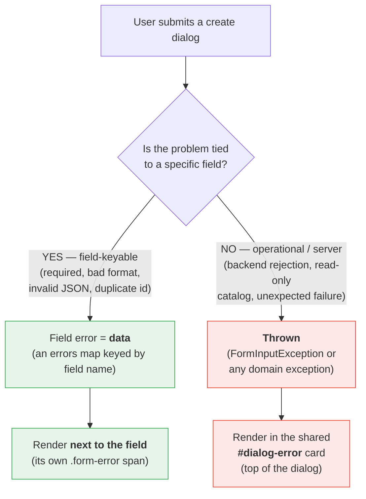
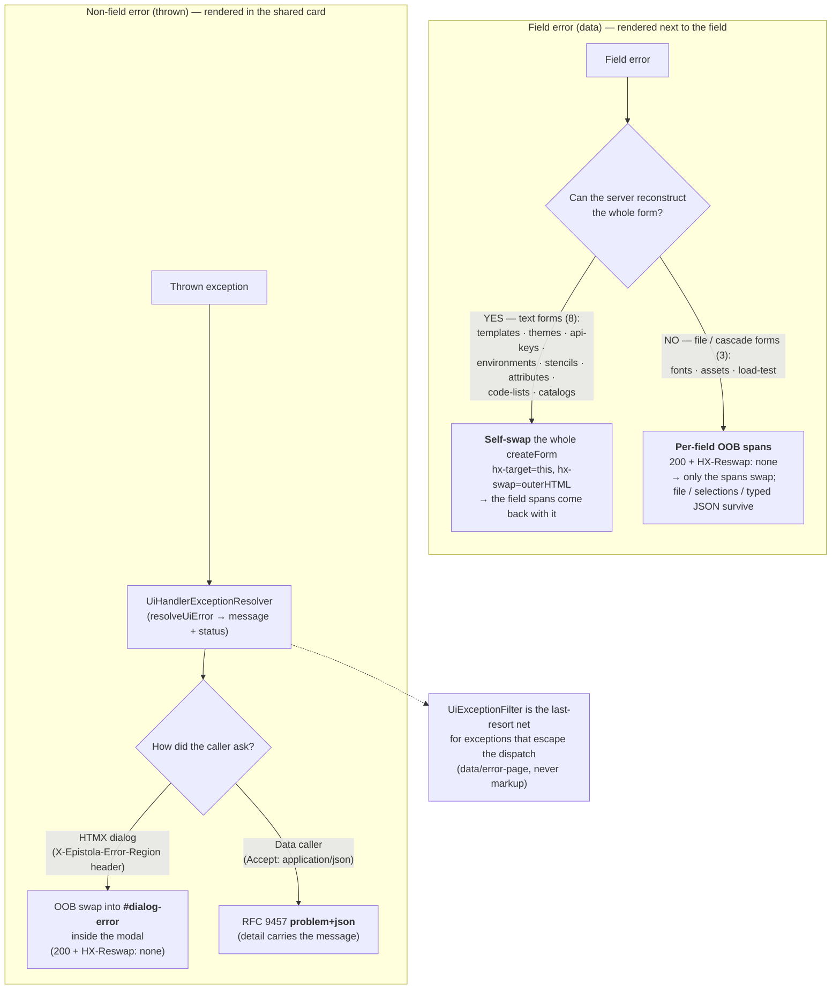
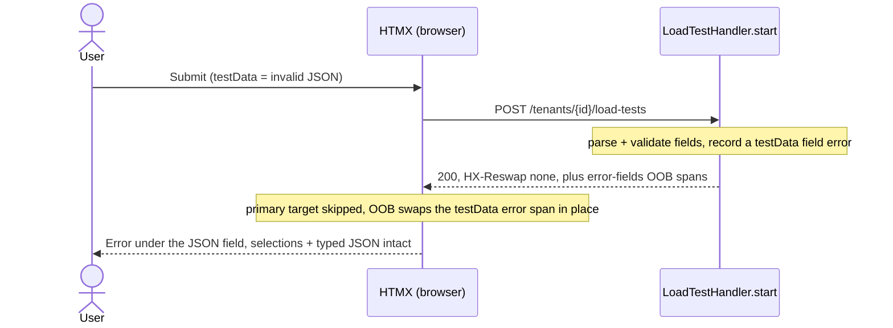
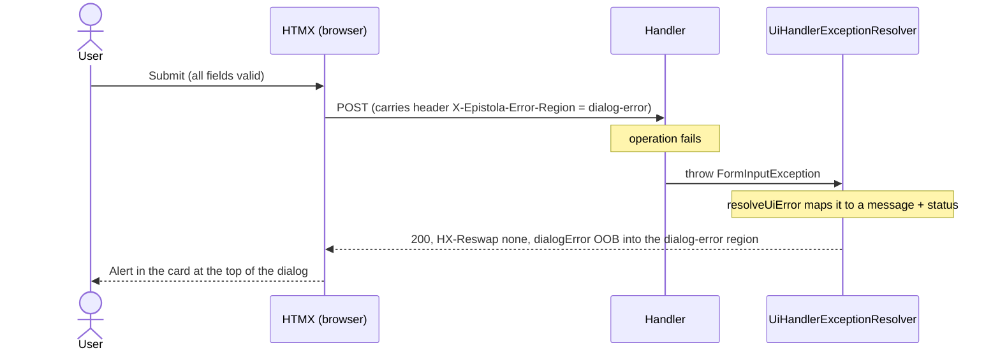
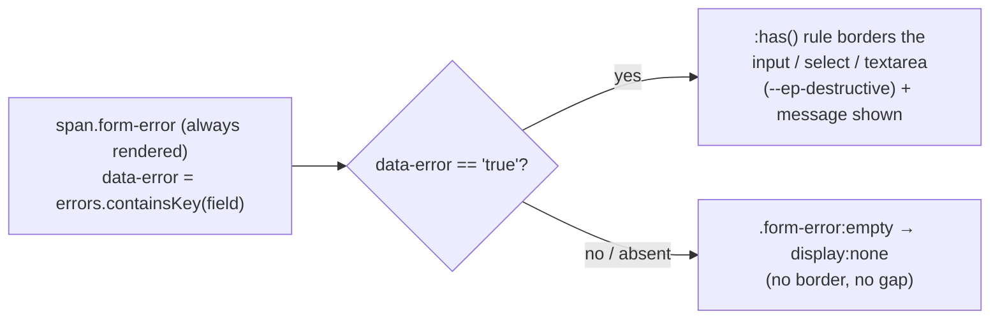
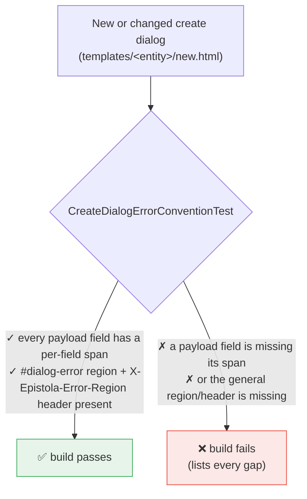

# Create-dialog error handling — a visual guide

A diagram-first companion to [ADR 0011](adr/0011-create-form-validation-errors.md) and
[`docs/htmx.md`](htmx.md) → "Create-form error handling". Read those for the prose and the
rationale; read this to see the shapes.

Every "create new" flow opens in a shared modal `<dialog>`. When a submit fails, **where** the
error renders is decided by one question: _is the problem tied to a specific field, or not?_

---

## 1. The core split: field vs. non-field



The rule of thumb: **a field problem belongs beside its field; the shared card is reserved for
problems that aren't about any single field.**

---

## 2. Three delivery mechanisms

Field errors are always "data," but _how_ they reach the page depends on whether the server can
re-render the whole form without destroying in-progress state. That splits the create dialogs into
two families. Thrown errors take a third, central path.



Why the file/cascade forms differ: a `<input type=file>` value can't be repopulated by the server,
and the load-test cascade selections + typed JSON can't be cheaply rebuilt — so re-rendering the
whole form would wipe what the user already did. The OOB path swaps **only** the error spans and
leaves everything else alone.

---

## 3. Sequence — a field error (load-test invalid JSON)

The case we most recently fixed: bad JSON in the load-test dialog renders **under the textarea**,
not as a banner, and nothing the user typed or selected is lost.



The same shape applies to `templateId` / `variantId` / `versionId` and to the fonts/assets
per-field errors — only the field id changes.

---

## 4. Sequence — a non-field (operational) error

When the field values are fine but the operation itself fails (e.g. the backend rejects the
load-test start), the handler **throws**, and the central resolver renders it into the card
_inside_ the modal.



The `X-Epistola-Error-Region` header is set on the `<dialog>` via `hx-headers`, so it rides along
on the form submit and tells the resolver which region to target. It's absent on every other HTMX
flow → zero blast radius.

---

## 5. How the border is drawn (one CSS rule, no server-toggled classes)

Every error span is **always** in the markup; styling is a pure function of its `data-error`
attribute, so the same rule works for a whole-form re-render and an OOB span swap.



```css
.form-group:has(.form-error[data-error="true"]) input,
.form-group:has(.form-error[data-error="true"]) textarea,
.form-group:has(.form-error[data-error="true"]) select {
  border-color: var(--ep-destructive);
}
.form-error:empty {
  display: none;
}
```

---

## 6. The convention, and how it's enforced

Both error surfaces are a **standing rule** for every create dialog — checked at build time by
`CreateDialogErrorConventionTest` (in `unitTest`), so a regression fails CI instead of silently
dropping a message.



**Exempt** (not part of the create payload, so they can't produce a field error): file inputs,
radio/checkbox choice groups, and a cascade-only helper select (load-test's `exampleId`). Each
exemption is listed with its reason in the test.

> This was a real bug, not just tidiness: five forms (templates, themes, stencils, attributes,
> code-lists) keyed a "Catalog is required" error to a `catalog` field that had **no span**, so the
> message silently vanished. The test makes that class of bug impossible to merge.

---

## At a glance — which form uses which path

| Dialog       | Field-error delivery   | General errors                        |
| ------------ | ---------------------- | ------------------------------------- |
| templates    | self-swap (whole form) | `#dialog-error` card                  |
| themes       | self-swap              | `#dialog-error` card                  |
| api-keys     | self-swap              | `#dialog-error` card                  |
| environments | self-swap              | `#dialog-error` card                  |
| stencils     | self-swap              | `#dialog-error` card                  |
| attributes   | self-swap              | `#dialog-error` card                  |
| code-lists   | self-swap              | `#dialog-error` card                  |
| catalogs     | self-swap              | `#dialog-error` card                  |
| fonts        | per-field OOB spans    | `#dialog-error` card                  |
| assets       | per-field OOB spans    | `#dialog-error` card / `problem+json` |
| load-test    | per-field OOB spans    | `#dialog-error` card                  |

The asset endpoint is the one that also answers `problem+json`, because the editor calls it
non-HTMX with `Accept: application/json`.
