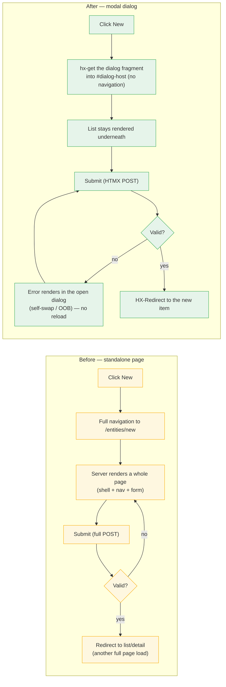
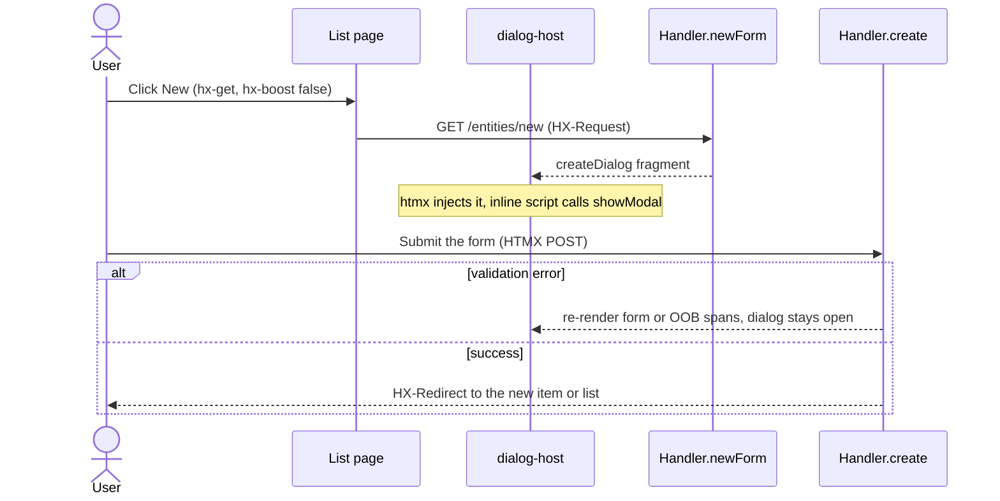
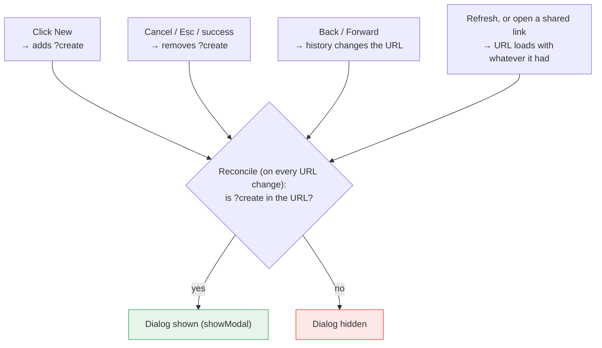
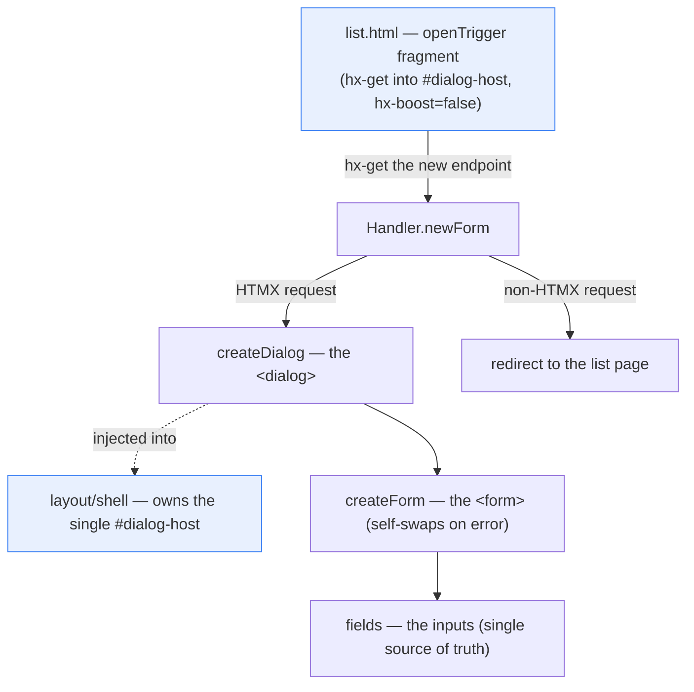

# Create forms in dialogs (not pages) — a visual guide

A diagram-first companion to [ADR 0007](adr/0007-create-forms-in-modal-dialogs.md) (the decision of
record), [`docs/htmx.md`](htmx.md) → "Create Forms: Modal Dialogs", and the `htmx-form` skill. Read
those for the decision and wiring details; read this for the shape of the change and its trade-offs.

**The change:** every "create new" flow used to navigate to its own `…/new` **page**. Now it opens
a modal `<dialog>` loaded over HTMX into a shared `#dialog-host`, while the list page stays put
underneath. There is no full-page `…/new` anymore — a direct (non-HTMX) `GET …/new` redirects to
the list.

---

## 1. Before vs. after

The page version reloads the whole shell twice (to open the form, and again after success). The
dialog version swaps a single fragment and never leaves the list.

---

## 2. The lifecycle: open → submit

The same handler endpoint serves two callers. Over HTMX it returns the **fragment**; a non-HTMX
request (no JS, or a bookmarked link) hits the `onNonHtmx` branch and **redirects to the list** —
so the dialog is the only way to render the form, and there is no half-styled standalone page to
maintain.

---

## 3. URL state: deep-linkable, refresh-safe, back-closable

The trick is that **the dialog's open/closed state is just a mirror of the URL**: opening a dialog
adds a query param (`?create`, or `?upload` for the file forms), closing removes it. A small
entity-agnostic reconcile script in `fragments/htmx` does one thing — read the URL and make the
dialog match — so every situation goes through the same check instead of being handled separately.

That single rule is what gives the three properties in the heading, for free:

- **Deep-linkable** — a shared `…?create` link loads with the param, so reconcile opens the dialog.
- **Refresh-safe** — refreshing reloads the same URL, so reconcile re-opens it.
- **Back-closable** — pressing Back changes the URL away from `?create`, so reconcile closes it.

Closing strips the param via `replaceState` (preserving any list filter already there), so the URL
never lies about what's on screen.

---

## 4. How it's composed

One shared host plus per-entity templates — the shell and the trigger/footer are shared; the
dialog/form/fields stay per-entity (self-contained, uniform) rather than one parameterized shell.

`hx-boost="false"` on the trigger is **required**: a boosted request would route to the handler's
non-HTMX branch and redirect to the list instead of returning the dialog.

---

## Pros vs. cons

### Pros

- **No full-page reloads** to start or finish a create — one fragment swap instead of two whole-page
  renders. Faster, and far less work for the server (no shell + nav re-render).
- **Context is preserved.** The list stays rendered underneath with its filters and scroll position;
  you return to exactly where you were.
- **Errors stay in place.** A validation error re-renders inside the open dialog (self-swap or OOB
  spans) — the user never loses the form or their input.
- **Still addressable.** `?create` / `?upload` make the open dialog deep-linkable, refresh-safe, and
  back-closable — you keep the one real advantage a page URL had.
- **Shared, thin wiring.** One `#dialog-host` + the open/close/reconcile script in `fragments/htmx`
  serve every entity; per-entity templates stay simple (three fragments, no routing of their own).

### Cons

- **More moving parts.** HTMX swap targets, the reconcile script, and CSP constraints (no `hx-on::*`
  — use inline `addEventListener`) are more to understand than a plain page + form POST.
- **Error handling needs discipline.** Because the form lives in a modal, a mishandled error can
  render behind it or vanish — which is exactly why the create-dialog error convention (per-field
  spans + the shared `#dialog-error` card) exists and is build-enforced. See
  [`docs/create-dialog-errors.md`](create-dialog-errors.md) and
  [ADR 0008](adr/0008-create-form-validation-errors.md).
- **No standalone form page.** A direct `GET …/new` redirects to the list, so there is no
  bookmarkable blank-form page and no progressive-enhancement fallback that renders the form without
  JS (the deep link opens the list, then the dialog, via HTMX).
- **File / cascade forms can't self-swap.** A file input or the load-test cascade can't be rebuilt
  server-side, so those forms need OOB per-field error handling (extra complexity the simple text
  forms avoid).
- **Focus / a11y depends on native `<dialog>`.** Correct focus trapping and Esc handling rely on
  `showModal()` / `:modal`; sub-region swaps inside a dialog (the load-test cascade) need
  `hx-disinherit` so descendants don't inherit the form's swap target.

**Net:** for creating a top-level entity from its list, the dialog wins — it's faster, keeps
context, and (with the error convention) handles failures gracefully. The cost is a one-time
investment in shared wiring and a strict error-rendering rule, both of which now exist.

---

## When to use which pattern

| Situation                                     | Pattern                                             |
| --------------------------------------------- | --------------------------------------------------- |
| Create a top-level entity from its list       | **Modal dialog** (this doc) — the default           |
| Create a child entity inline on a detail page | Inline HTMX create (swaps a section, not a dialog)  |
| Edit an existing entity                       | Dialog edit (HTMX GET + PATCH with retarget/reswap) |
| A one-shot action (set-default, toggle)       | HTMX action (no form page at all)                   |

See the `htmx-form` skill for the full template/handler/routes recipe for each.
