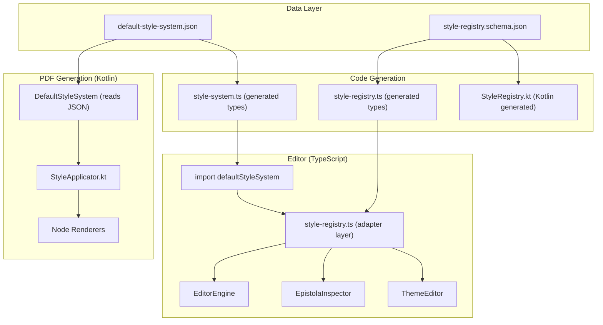
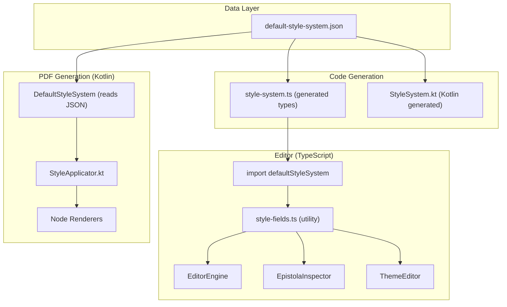
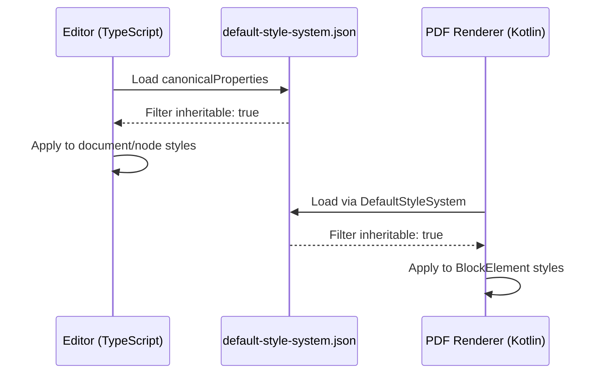

# Style Support Parity (`#193`)

## Context

Issue `#193` is the main problem to solve first. The current styling system drifts because the editor and the PDF renderer do not share one canonical runtime contract.

Today:

- The editable style vocabulary lives in `modules/editor/src/main/typescript/engine/style-registry.ts`
- Browser rendering mostly applies resolved keys as CSS in `modules/editor/src/main/typescript/ui/EpistolaCanvas.ts` and `modules/editor/src/main/typescript/ui/EpistolaTextEditor.ts`
- PDF rendering applies a separate hardcoded subset in `modules/generation/src/main/kotlin/app/epistola/generation/pdf/StyleApplicator.kt`
- Inheritable keys are derived in TypeScript but hardcoded again in Kotlin

This is the root cause of styling bugs where a field appears in the editor but does not actually work in browser preview or PDF output.

UI polish for the theme editor (`#191`) is explicitly deferred until this foundation is fixed.

## Goal

Create one schema-first shared style contract so that:

- a supported style property has one canonical meaning
- browser preview and PDF rendering support the same canonical properties
- the editor can render fields dynamically from shared metadata
- composite editor controls such as `margin` and `padding` map cleanly to canonical stored properties
- drift is caught by tests instead of being discovered manually

## Architecture Overview

This section provides a high-level view of the style system refactoring from dual `StyleRegistry`/`StyleSystem` architecture to a single-source-of-truth `StyleSystem`.

### Before: Dual System Architecture

The codebase had **two parallel style definition systems**:

1. **`StyleSystem`** - The canonical source defining:
   - `canonicalProperties`: CSS properties supported by both browser preview and PDF rendering
   - `editorGroups`: UI field definitions for the style inspector

2. **`StyleRegistry`** - A duplicate layer that:
   - Was generated from a separate JSON schema (`style-registry.schema.json`)
   - Required an adapter (`style-registry.ts`) to map `StyleSystem` → `StyleRegistry`
   - Added maintenance burden (schema → generated types → adapter)



### After: Single Source of Truth

The `StyleRegistry` has been eliminated. The editor now uses `StyleSystem` directly through a thin utility module (`style-fields.ts`).



### Key Improvements

| Aspect | Before | After |
|--------|--------|-------|
| **JSON Schemas** | 2 (`style-system`, `style-registry`) | 1 (`style-system`) |
| **Generated TypeScript** | 2 files | 1 file |
| **Adapter Code** | ~267 lines in `style-registry.ts` | ~213 lines in `style-fields.ts` |
| **Type Safety** | Required casting (`field.control as StyleProperty['type']`) | Direct property access |
| **API Complexity** | `EditorEngine` required `styleRegistry` parameter | No `styleRegistry` parameter needed |
| **Cross-Platform Parity** | Risk of drift between TS and Kotlin | Both read from same `default-style-system.json` |

### Style Cascade Flow

Both TypeScript and Kotlin now derive inheritable keys from the same source:



### Files Changed

**Deleted:**
- `modules/template-model/schemas/style-registry.schema.json`
- `modules/template-model/generated/style-registry.ts`
- `modules/editor/src/main/typescript/engine/style-registry.ts`
- `modules/editor/src/main/typescript/engine/style-registry.test.ts`

**Created:**
- `modules/editor/src/main/typescript/engine/style-fields.ts` - Thin utility module working directly with `StyleSystem`

**Modified:**
- `EditorEngine.ts` - Removed `styleRegistry` parameter, uses `getInheritableKeys()` directly
- `EpistolaInspector.ts` - Uses `defaultStyleFieldGroups` and `isStyleFieldInheritable()`
- `ThemeEditorState.ts` - Updated imports
- `DocumentStylesSection.ts` - Migrated from `StyleProperty` to `StyleField`
- `PresetItem.ts` - Migrated from `StyleProperty` to `StyleField`
- `styles.ts` and `styles.test.ts` - Simplified to use no parameters

## Design Decisions

- **Schema-first**: the source of truth lives in `modules/template-model`, not in editor-only TypeScript or Kotlin-only code
- **Two layers**:
  - canonical style properties: the real stored and rendered keys
  - editor field metadata: labels, groups, widgets, options, units, and field-to-property mappings
- **Canonical properties are explicit**: use longhand storage/rendering keys such as `marginTop`, `marginRight`, `marginBottom`, `marginLeft` rather than ambiguous shorthand semantics
- **Composite controls stay in the UI layer**: a `margin` field is acceptable as an editor abstraction, but it must map to canonical properties defined in the shared contract
- **No duplicate Kotlin allowlist**: if a canonical property is present in the shared contract, it is expected to be supported; we should not maintain a second manual support list that can drift
- **No aspirational fields**: do not expose style properties in the shared contract unless both browser and PDF behavior are defined
- **No storage migration in the first pass**: keep `documentStyles` and preset `styles` as open maps for now; refactor the contract first, then consider storage cleanup later if still needed

## Where To Start

Start with an audit, not implementation.

Before changing the contract, build a support matrix for all currently known style keys and classify each one as:

- editor field exists
- browser preview works
- PDF rendering works
- inheritable
- hidden or unsupported

This audit should cover at least:

- `modules/editor/src/main/typescript/engine/style-registry.ts`
- `modules/editor/src/main/typescript/ui/inputs/style-inputs.ts`
- `modules/editor/src/main/typescript/ui/EpistolaInspector.ts`
- `modules/editor/src/main/typescript/theme-editor/sections/DocumentStylesSection.ts`
- `modules/editor/src/main/typescript/theme-editor/sections/PresetItem.ts`
- `modules/editor/src/main/typescript/ui/EpistolaCanvas.ts`
- `modules/editor/src/main/typescript/ui/EpistolaTextEditor.ts`
- `modules/generation/src/main/kotlin/app/epistola/generation/pdf/StyleApplicator.kt`

The point of the audit is to discover every mismatch before we move the source of truth.

## Audit: Current Gap Matrix

Status legend used below:

- `yes`: present and behaves as expected in that layer
- `partial`: present, but semantics or value handling are incomplete
- `no`: not supported in that layer
- `hidden`: supported in runtime data/code, but not exposed in the editor registry

### Current editor-exposed fields

| Field | UI contexts | Current stored key(s) | Browser preview | PDF rendering | Inheritable | Audit notes |
|------|-------------|-----------------------|-----------------|---------------|-------------|-------------|
| `fontFamily` | document, node, preset | `fontFamily` | yes | yes | yes | **IMPLEMENTED**: Three font families supported: Liberation Sans, Liberation Serif, Liberation Mono. |
| `fontSize` | document, node, preset | `fontSize` | yes | yes | yes | This is the cleanest current candidate for a canonical shared property. |
| `fontWeight` | document, node, preset | `fontWeight` | yes | yes | yes | **IMPLEMENTED**: Numbered weights (100-900), >=500 maps to bold font variant in PDF. |
| `fontStyle` | document, node, preset | `fontStyle` | yes | yes | yes | **IMPLEMENTED**: Supports normal and italic values. |
| `color` | document, node, preset | `color` | yes | yes | yes | Stable candidate for the shared canonical set. |
| `lineHeight` | document, node, preset | `lineHeight` | yes | browser only | yes | **DEFERRED**: PDF architecture creates Div containers first, then adds Paragraphs. lineHeight is only available on Paragraph, not BlockElement. Would require passing styles to TipTapConverter. Works in browser preview only. |
| `letterSpacing` | document, node, preset | `letterSpacing` | yes | yes | yes | **IMPLEMENTED**: Applied via BlockElement.setCharacterSpacing() from ElementPropertyContainer. |
| `textAlign` | document, node, preset | `textAlign` | yes | yes | yes | Stable candidate for the shared canonical set. |
| `padding` | node, preset | `paddingTop`, `paddingRight`, `paddingBottom`, `paddingLeft` | yes | yes | no | **IMPLEMENTED**: Generic BoxValue pattern with `undefined` = inherit from component defaults. Supports four link modes (All, Horizontal, Vertical, None). Clear buttons for explicit values. Reusable pattern for future composite properties. |
| `margin` | node, preset | `marginTop`, `marginRight`, `marginBottom`, `marginLeft` | yes | yes | no | **IMPLEMENTED**: Same BoxValue pattern as padding. Component defaults (e.g., `marginBottom: 0.5em`) properly inherited when sides not explicitly set. |
| `backgroundColor` | node, preset | `backgroundColor` | yes | yes | no | Works as a block style, but it is not available as a document style; page background is modeled separately in page settings. |
| `borderWidth` | node, preset | `borderWidth` | yes | no | no | Browser forwards it as CSS, but the generic PDF renderer ignores it. Visual effect in browser also depends on a matching border style. |
| `borderStyle` | node, preset | `borderStyle` | partial | no | no | CSS border style works in browser, but this key also collides with table/datatable props named `borderStyle` that mean `all`, `horizontal`, `vertical`, or `none` instead of CSS values. |
| `borderColor` | node, preset | `borderColor` | yes | no | no | Browser forwards it as CSS, but the generic PDF renderer ignores it. |
| `borderRadius` | node, preset | `borderRadius` | yes | yes | no | Applied to all four corners independently via `borderTopLeftRadius`, `borderTopRightRadius`, `borderBottomRightRadius`, `borderBottomLeftRadius` canonical properties. |

### Hidden or runtime-only keys discovered during audit

| Key | Editor registry field | Current stored key(s) | Browser preview | PDF rendering | Inheritable | Audit notes |
|-----|------------------------|-----------------------|-----------------|---------------|-------------|-------------|
| `fontStyle` | exposed | `fontStyle` | yes | yes | yes | **FIXED**: Now exposed in editor registry. |
| `borderLeft` | hidden | `borderLeft` | partial | no | no | Present in demo preset data; browser can apply it on components with `applicableStyles: 'all'`, but it is not modeled in the registry or PDF renderer. |
| `width` | exposed | `width` | yes | yes | no | **IMPLEMENTED**: Added to canonical properties. Supports px, em, rem, pt, and % units. Available on text, container, and image components. |

### Additional findings from the audit

- Composite spacing behavior is defined in `modules/editor/src/main/typescript/ui/inputs/style-inputs.ts` with the generic `BoxValue` pattern, usable for future properties like border-width and border-radius.
- Existing stored values already fail to round-trip cleanly through the current editor widgets:
  - `modules/epistola-core/src/main/kotlin/app/epistola/suite/tenants/commands/CreateTenant.kt` stores `fontFamily = "Helvetica, Arial, sans-serif"`, which is not one of the current select options.
  - `modules/epistola-core/src/main/kotlin/app/epistola/suite/tenants/commands/CreateTenant.kt` stores `lineHeight = "1.5"`, which the current unit input treats like a value with the default unit.
  - `apps/epistola/src/main/kotlin/app/epistola/suite/demo/DemoLoader.kt` stores `fontWeight = "bold"`, `fontStyle = "italic"`, and `borderLeft = "3px solid #cccccc"`, but the current registry cannot represent all of them.
- `borderStyle` already has a semantic collision today. In the style registry it means CSS border style, but in `modules/editor/src/main/typescript/components/table/table-registration.ts` and `modules/editor/src/main/typescript/components/datatable/datatable-registration.ts` it also exists as a prop with table-border-mode semantics.
- Inheritance is duplicated today: TypeScript derives inheritable keys from the registry, while Kotlin hardcoded them in `modules/generation/src/main/kotlin/app/epistola/generation/pdf/StyleApplicator.kt`.
- Component default styles are duplicated today: editor defaults live in `modules/editor/src/main/typescript/engine/registry.ts`, while PDF defaults live in `modules/generation/src/main/kotlin/app/epistola/generation/pdf/RenderingDefaults.kt`.

## First Canonical Property List

The first shared canonical contract should be intentionally strict.

### Admit now (IMPLEMENTED)

- `fontSize`
- `fontFamily` ✓
- `fontWeight` ✓
- `fontStyle` ✓
- `color`
- `textAlign`
- `letterSpacing` ✓
- `lineHeight` (browser only - PDF deferred)
- `backgroundColor`
- `width` ✓
- `marginTop`
- `marginRight`
- `marginBottom`
- `marginLeft`
- `paddingTop`
- `paddingRight`
- `paddingBottom`
- `paddingLeft`

### Border Properties (IMPLEMENTED)

- `borderTopWidth` ✓
- `borderTopStyle` ✓
- `borderTopColor` ✓
- `borderRightWidth` ✓
- `borderRightStyle` ✓
- `borderRightColor` ✓
- `borderBottomWidth` ✓
- `borderBottomStyle` ✓
- `borderBottomColor` ✓
- `borderLeftWidth` ✓
- `borderLeftStyle` ✓
- `borderLeftColor` ✓
- `borderTopLeftRadius` ✓
- `borderTopRightRadius` ✓
- `borderBottomRightRadius` ✓
- `borderBottomLeftRadius` ✓

### Defer

- `lineHeight` in PDF rendering (architectural change required)
- any new style properties beyond the strict list above

### Editor fields for the first pass

The editor should expose the admitted canonical properties through these first-pass fields:

- `fontSize`
- `fontFamily` ✓
- `fontWeight` ✓
- `fontStyle` ✓
- `color`
- `textAlign`
- `lineHeight` ✓
- `letterSpacing` ✓
- `backgroundColor`
- `margin` -> maps to `marginTop`, `marginRight`, `marginBottom`, `marginLeft`
- `padding` -> maps to `paddingTop`, `paddingRight`, `paddingBottom`, `paddingLeft`
- `border` -> maps to width/style/color for all 4 sides
- `borderRadius` -> maps to `borderTopLeftRadius`, `borderTopRightRadius`, `borderBottomRightRadius`, `borderBottomLeftRadius`

## Implementation Notes (2026-03-13) - Typography Properties Pass

### What was implemented in the second pass

This pass focused on admitting the 5 deferred typography properties from the "Fix before admit" list.

**Font Additions:**
- Downloaded and integrated Liberation Serif and Liberation Mono fonts (v2.1.5) alongside existing Liberation Sans
- All fonts licensed under SIL Open Font License (same as existing fonts)
- Added 8 new font files: Regular, Bold, Italic, BoldItalic for both Serif and Mono families

**Schema Updates:**
- Added `"number"` to the `valueKind` enum in `style-system.schema.json`
- This enables proper handling of unitless numeric values like lineHeight (1.5)

**New Canonical Properties Added:**
1. `fontFamily` (keyword) - Liberation Sans, Serif, or Mono
2. `fontWeight` (number) - 100-900 scale, >=500 maps to bold
3. `fontStyle` (keyword) - normal or italic
4. `lineHeight` (number) - unitless multiplier (browser preview only)
5. `letterSpacing` (unit) - em/px/rem values

All five properties are marked as `inheritable: true` since they cascade from document to block elements.

**Editor Integration:**
- Font Family: select field with 3 options
- Font Weight: select field with labeled numeric options (100-900)
- Font Style: select field (normal, italic)
- Line Height: number input with decimal support (step="any")
- Letter Spacing: unit input (em, px, rem)

**PDF Rendering - FontCache.kt:**
- Introduced `FontFamily` enum with SANS, SERIF, MONO values
- Added `getFont(family, weight, italic)` method for unified font selection
- Legacy accessors (regular, bold, italic, boldItalic) default to Sans family for backward compatibility
- Font selection logic: weight >= 500 → bold, italic flag selects italic variant

**PDF Rendering - StyleApplicator.kt:**
- Integrated font family, weight, and style selection into unified font application
- Added `letterSpacing` support via `BlockElement.setCharacterSpacing()`
- Documented `lineHeight` limitation: only available on Paragraph, not BlockElement

### Problems encountered and how they were resolved

#### 1. iText BlockElement vs Paragraph API limitations

**The Problem:**
- `letterSpacing` is available on BlockElement via inherited `setCharacterSpacing()`
- `lineHeight` is ONLY available on Paragraph via `setFixedLeading()` and `setMultipliedLeading()`
- Our architecture creates Div containers first, then adds Paragraphs during TipTap conversion

**Why this matters:**
The current flow:
1. Create Div container for node
2. Apply styles to Div via StyleApplicator
3. Convert content via TipTapConverter (creates Paragraphs inside Div)

By step 3, we've lost the ability to apply lineHeight to the Paragraphs that were created.

**Options considered:**

1. **Pass styles through to TipTapConverter**
   - Modify RenderContext to carry style values
   - Apply lineHeight when creating Paragraph elements
   - Pros: Clean, would work for all text content
   - Cons: Requires architectural changes to text conversion pipeline

2. **Cast to Paragraph in specific renderers**
   - Only works for TextNodeRenderer which creates Paragraphs
   - Doesn't work for Div containers or other block elements
   - Pros: Minimal change
   - Cons: Inconsistent behavior

3. **Defer lineHeight PDF support**
   - Keep in contract for browser preview
   - Document as browser-only feature
   - Implement properly with architecture changes later
   - Pros: Safe, no half-working features
   - Cons: Feature gap between browser and PDF

**Chosen solution:**

Option 3 - defer lineHeight PDF support for now. We will need to consult with senior developers about the best architectural approach for passing styles through the text conversion pipeline.

**Implementation:**
- Added detailed comment in StyleApplicator.kt explaining why lineHeight isn't applied
- lineHeight works correctly in browser preview (via CSS)
- lineHeight is defined in the shared contract for future PDF support

### Why letterSpacing works but lineHeight doesn't

**letterSpacing:**
- Available on: `BlockElement` (via `ElementPropertyContainer.setCharacterSpacing()`)
- Our elements: Div, Paragraph, Cell all extend BlockElement
- Can be applied at the container level ✓

**lineHeight:**
- Available on: `Paragraph` only (via `setFixedLeading()` / `setMultipliedLeading()`)
- Our architecture: Creates Div first, Paragraphs added later by TipTapConverter
- Cannot be applied at the container level ✗
- Would need to be applied during Paragraph creation

### Verification completed for this pass

The following checks passed after the implementation:

- `pnpm test` - All 793 TypeScript tests pass
- `./gradlew ktlintCheck build` - Full build with linting passes
- New test added for letterSpacing in StyleApplicatorTest.kt

## Implementation Notes (2026-03-12) - First Pass

### What was implemented in the first pass

- Added the shared schema-first contract in `modules/template-model/schemas/style-system.schema.json`
- Added the first strict runtime data set in `modules/template-model/data/style-system/default-style-system.json`
- Added TypeScript access through `modules/template-model/ts/style-system.ts`
- Added Kotlin access through `modules/template-model/src/main/kotlin/app/epistola/template/model/DefaultStyleSystem.kt`
- Replaced the editor-only registry source of truth in `modules/editor/src/main/typescript/engine/style-registry.ts` with a compatibility adapter derived from the shared contract
- Moved shared parsing helpers into `modules/editor/src/main/typescript/engine/style-values.ts` so spacing/value behavior is not trapped inside a single input file
- Updated editor consumers to use shared field mapping instead of hardcoded `margin` / `padding` special cases:
  - `modules/editor/src/main/typescript/ui/EpistolaInspector.ts`
  - `modules/editor/src/main/typescript/theme-editor/ThemeEditorState.ts`
  - `modules/editor/src/main/typescript/theme-editor/sections/PresetItem.ts`
- Updated `modules/editor/src/main/typescript/ui/inputs/style-inputs.ts` so spacing writes preserve explicit zero values instead of deleting them
- Updated `modules/generation/src/main/kotlin/app/epistola/generation/pdf/StyleApplicator.kt` so inheritable keys come from the shared contract instead of a hardcoded Kotlin set
- Added focused regression coverage for the adapter and spacing behavior in:
  - `modules/editor/src/main/typescript/engine/style-registry.test.ts`
  - `modules/editor/src/main/typescript/ui/inputs/style-inputs.test.ts`
  - `modules/editor/src/main/typescript/theme-editor/ThemeEditorState.test.ts`
  - `modules/generation/src/test/kotlin/app/epistola/generation/pdf/StyleApplicatorTest.kt`

### Problems encountered and how they were resolved (First Pass)

#### 1. Kotlin shared-contract loading needed runtime JSON support

Once the style system moved into shared `template-model` data, Kotlin needed a reliable way to load `default-style-system.json`.

What we considered:

- **Reuse the existing Spring BOM pattern** used by modules like `epistola-core`, `feedback`, and `editor`
- **Move the JSON loader into a consumer module** so `template-model` stayed schema-only
- **Add an explicit library version in the version catalog** and keep the loader in `template-model`

What we tried first:

- We tried the Spring dependency-management plugin + Boot BOM approach because that matches several other modules in the repo

Why that was not enough:

- `template-model` is a library consumed transitively by modules that do not import the Spring BOM in the same way at resolution time
- A versionless `tools.jackson.module:jackson-module-kotlin` declaration in `template-model` still caused downstream resolution failures during full builds

Chosen solution:

- Add `jackson3-kotlin` to `gradle/libs.versions.toml` and use `implementation(libs.jackson3.kotlin)` in `modules/template-model/build.gradle.kts`

Why this solution was chosen:

- The shared loader belongs with the shared contract data
- `template-model` is a library module, so its exported dependencies need explicit, stable resolution outside Spring Boot application modules
- This keeps the contract and its loader together without relying on downstream BOM behavior

#### 2. Full root builds surfaced a pre-existing generated-override task-order bug

Targeted editor tests and targeted generation tests passed, but the full `./gradlew ktlintCheck build` exposed a different problem.

What happened:

- `template-model` already generated Kotlin classes that must be deleted because the codegen tool cannot correctly model `DocumentStyles`, `TemplateDocument`, `Expression`, and `ThemeRef`
- The existing wiring used `generate.finalizedBy(removeGeneratedOverrides)` plus `compileKotlin.dependsOn("generate")`
- In the full multi-module build, downstream compilation still observed the bad generated classes before cleanup had taken effect

How we confirmed it:

- The resulting `template-model` jar contained generated `TemplateDocument$Nodes`, `TemplateDocument$Slots`, and generated `DocumentStyles` classes, which should never survive when handwritten overrides are intended to win

What we considered:

- **Leave the existing `finalizedBy` wiring alone** and treat the failure as incidental
- **Use ordering-only hints such as `mustRunAfter`**
- **Make cleanup part of the actual compilation dependency chain**

Chosen solution:

- Change the task wiring so `removeGeneratedOverrides` depends on `generate`
- Make `compileKotlin` depend directly on `removeGeneratedOverrides`

Why this solution was chosen:

- It guarantees generated override cleanup happens before Kotlin compilation starts
- It fixes the real build contract instead of hoping Gradle finalizer timing is strong enough in a multi-module graph
- A comment was added in `modules/template-model/build.gradle.kts` explaining why the old behavior was too weak and why the direct dependency is required

### Why the first pass stays strict

- The goal of this pass is to remove drift, not to expand styling surface area
- Admitting only the clean subset keeps browser behavior, PDF behavior, shared metadata, and tests aligned
- The deferred typography properties (`fontFamily`, `fontWeight`, `fontStyle`, `lineHeight`, `letterSpacing`) need a second pass because their current semantics, stored values, or PDF behavior are still inconsistent
- Border properties remain deferred because `borderStyle` already has a semantic collision with table/datatable props and should not be normalized hastily

### Verification completed for first pass

The following checks passed after the implementation and the task-order fix:

- `pnpm test`
- `pnpm build`
- `./gradlew ktlintCheck build`

Non-blocking warnings remain in the repo, including JDK 25 -> Kotlin JVM 24 fallback warnings, Kotlin compiler warnings in unrelated modules, and Playwright host warnings, but there were no test failures or lint failures.

## Execution Plan

### Phase 1: Define the shared contract in `template-model` ✓ COMPLETED

Move the style system definition into `modules/template-model`.

Introduce shared schema-backed definitions for:

- canonical style properties
- editor field metadata

The canonical layer should define runtime meaning only, for example:

- key
- value kind
- inheritable flag
- allowed contexts if needed

The editor metadata layer should define presentation and mapping only, for example:

- group
- label
- widget type
- units
- options
- mapped canonical property keys

The generated types should continue to come from `modules/template-model` for both TypeScript and Kotlin.

### Phase 2: Replace the TS-only registry with a compatibility adapter ✓ COMPLETED

Do not rewrite the whole editor in one step.

Instead:

- keep the current editor runtime behavior stable
- replace `modules/editor/src/main/typescript/engine/style-registry.ts` as the source of truth
- adapt the shared contract into the shape needed by current editor consumers

This adapter should feed:

- `EditorEngine`
- `EpistolaInspector`
- theme editor document style rendering
- theme editor preset style rendering

The temporary adapter is allowed to preserve current spacing expansion behavior while the shared contract settles.

### Phase 3: Align browser behavior to the canonical contract ✓ COMPLETED

Once the contract is shared, update browser-side style resolution to rely on canonical property definitions instead of editor-only assumptions.

Focus on:

- inheritance derivation
- applicable style filtering
- composite field expansion to canonical properties
- CSS application in preview/canvas

The browser should no longer depend on a private TS registry that Kotlin cannot see.

### Phase 4: Align PDF rendering to the canonical contract ✓ COMPLETED (with lineHeight deferred)

Update `StyleApplicator.kt` so it stops being a second source of truth.

Specifically:

- remove duplicated inheritable-key definitions ✓
- derive support from the shared canonical contract ✓
- implement application logic for every canonical property that remains in the contract ✓
- added font family support with Liberation Sans/Serif/Mono ✓
- added letterSpacing support via setCharacterSpacing() ✓
- documented lineHeight limitation (Paragraph-only API) ✓

If a property cannot be implemented correctly in PDF rendering yet, it should not stay in the canonical supported property list. Exception: `lineHeight` is kept in the contract for browser preview, with documentation noting PDF limitation.

### Phase 5: Add parity tests ✓ COMPLETED

Add functional tests that fail when the browser/editor and PDF sides drift.

At minimum, cover:

- shared contract loading on both sides
- inheritable key parity ✓ (updated for new typography keys)
- style support parity
- PDF application tests for each supported canonical property
- editor mapping tests for composite fields such as `margin` and `padding`

The goal is to make issue `#193` difficult to reintroduce.

## Immediate Deliverables For `#193`

This change should produce the following outcomes before any theme editor polish work begins:

- one shared schema-first style contract in `modules/template-model` ✓
- no editor-only style vocabulary source of truth ✓
- no Kotlin-only inheritable style list ✓
- clear mapping from editor fields to canonical properties ✓
- supported properties behave consistently in browser and PDF ✓ (with lineHeight documented as exception)
- tests fail when support drifts ✓

## Explicitly Deferred

The following work is not part of this change:

- `lineHeight` support in PDF rendering (requires architectural changes to TipTapConverter)
- theme editor layout and width improvements for `#191`
- preview endpoint work
- large UI polish passes unrelated to style support parity
- new style features beyond what we can support consistently in both browser and PDF

## Acceptance Criteria

The refactor is complete when all of the following are true:

- if a canonical style property exists in the shared contract, it is supported consistently by browser preview and PDF rendering ✓
- editor fields are generated from shared metadata instead of hardcoded editor-only definitions ✓
- composite fields map to canonical properties without hidden special cases ✓
- there is no second manual Kotlin allowlist that can silently drift ✓
- tests protect the contract and parity rules ✓

## Follow-Up After `#193`

After the style contract is stable, return to `#191` and improve the theme editor UX on top of the new foundation.

## Known Issues for Future Resolution

### lineHeight PDF Support

**Problem:** lineHeight works in browser preview but not in PDF.

**Root Cause:** iText's API has `setMultipliedLeading()` on Paragraph but not on BlockElement. Our architecture creates Div containers first, then Paragraphs are added during TipTap conversion. By the time Paragraphs exist, we've lost access to the style values.

**Potential Solutions:**
1. Pass style values through RenderContext to TipTapConverter
2. Create a paragraph factory that applies styles during creation
3. Restructure text rendering to create Paragraphs directly instead of Divs

**Status:** Deferred pending senior developer consultation on architecture approach.

### em/rem Unit Support in PDF

**Problem:** Relative units (`em` and `rem`) produce different results in browser preview vs PDF output.

**Current Behavior:**
- **Browser (CSS)**: `em` compounds through nested elements (relative to parent), `rem` is relative to document root font size
- **PDF (iText)**: Both `em` and `rem` are resolved against a fixed 12pt base; no compounding occurs
- **Result**: Font sizes and spacing can appear significantly different between editor preview and generated PDF

**Root Cause:** iText only supports absolute units (pt, px, mm, cm). Our StyleApplicator converts `em`/`rem` to points at render time using a fixed base, but cannot track the actual computed font size through the element tree because:
1. iText elements don't maintain parent references
2. Our renderers are stateless and don't pass cascade context
3. Proper CSS-style cascade would require architectural changes to track computed values

**Potential Solutions:**
1. **Remove em/rem entirely** - Only support px/pt for guaranteed parity (breaking change)
2. **Pre-resolve at generation time** - Walk document tree before rendering, compute absolute values, pass them to renderers
3. **Track cascade in RenderContext** - Add computed font size to RenderContext, update as we traverse, use it for em/rem conversion
4. **Use iText's relative unit support** - Investigate if newer iText versions support relative units natively (currently using 9.5.0)

**Status:** Documented as known limitation. Users should use `px` or `pt` for consistent results.

## Implementation Notes (2026-03-13) - Composite Spacing Pass

### What was implemented in the third pass

This pass focused on refactoring composite spacing fields (`margin`/`padding`) to support proper default inheritance, addressing the long-standing issue where explicit zero values couldn't reliably override component defaults.

**Core Architecture Changes:**

1. **BoxValue Interface**: Replaced `SpacingValue` with a more generic `BoxValue` interface:
   - `top/right/bottom/left: string | undefined`
   - `undefined` means "use default/inherit"
   - `string` means explicitly set value (including "0px")

2. **Smart Linking System**: Four link modes for efficient editing:
   - **All**: All four sides linked (change one, all update)
   - **Horizontal**: Left and right linked (for symmetric horizontal spacing)
   - **Vertical**: Top and bottom linked (for symmetric vertical spacing)
   - **None**: Each side independent

3. **Clear Buttons**: Small × button appears only when a side has an explicit value. Clicking resets to `undefined`, allowing the side to inherit from component defaults.

4. **Component Default Integration**: Editor now properly extracts component defaults (e.g., `marginBottom: 0.5em` for text blocks) and uses them as placeholders. Unset sides show the default value but don't write it to storage.

5. **Smart Write Behavior**: `expandBoxToStyles()` only writes explicitly defined sides. Missing sides (undefined) don't get written, allowing proper inheritance from:
   - Component defaults (e.g., text blocks get 0.5em bottom margin)
   - Document styles
   - Preset styles

**Files Modified:**
- `style-values.ts`: BoxValue interface, helper functions
- `style-inputs.ts`: renderBoxInput with linking system, clear buttons
- `EpistolaInspector.ts`: Component defaults integration
- `PresetItem.ts`: Preset editing with BoxValue

**Legacy Support:**
- Maintained backward compatibility with deprecated function aliases
- Added defensive checks for malformed data (arrays as objects)
- CSS shorthand parsing for legacy compound keys (e.g., `margin: "10px 20px"`)

**Reusability:**
This BoxValue pattern is designed for reuse with:
- `borderWidth` (top, right, bottom, left)
- `borderRadius` (top-left, top-right, bottom-right, bottom-left)
- Future composite properties

### Verification completed for this pass

- `pnpm test` - All 799 TypeScript tests pass
- `./gradlew ktlintCheck build` - Full build with linting passes
- 16 new tests for BoxValue functions, linking behavior, and default inheritance

## Implementation Notes (2026-03-16) - Border Radius PDF Pass

### What was implemented in this pass

This pass focused on implementing border-radius support in PDF rendering, completing the feature parity for borders between browser preview and PDF output.

**Implementation Details:**

1. **iText 9.5.0 API Integration**: Added support for the 4 canonical border-radius properties:
   - `borderTopLeftRadius` -> `BlockElement.setBorderTopLeftRadius(BorderRadius)`
   - `borderTopRightRadius` -> `BlockElement.setBorderTopRightRadius(BorderRadius)`
   - `borderBottomRightRadius` -> `BlockElement.setBorderBottomRightRadius(BorderRadius)`
   - `borderBottomLeftRadius` -> `BlockElement.setBorderBottomLeftRadius(BorderRadius)`

2. **Unit Conversion**: Border radius values are parsed using the existing `parseSize()` helper, which supports:
   - `px` -> converted to points (pt) using 0.75x factor
   - `pt` -> used directly
   - `em`/`rem` -> resolved against base font size (12pt default)
   - Zero or negative values are ignored (no radius applied)

3. **Zero Value Handling**: Values of `0px` or less are intentionally skipped, allowing elements to have square corners when no radius is desired or when inheriting from defaults.

**Files Modified:**
- `StyleApplicator.kt`: Added `applyBorderRadius()` function and integrated it into the style application flow
- `StyleApplicatorTest.kt`: Added 5 new tests covering single corner, all corners, zero values, em units, and missing keys

**Style System Contract:**
The existing canonical properties defined in `default-style-system.json` are now fully supported in both browser and PDF:
```json
{ "key": "borderTopLeftRadius", "label": "Border Top Left Radius", "valueKind": "unit", "inheritable": false },
{ "key": "borderTopRightRadius", "label": "Border Top Right Radius", "valueKind": "unit", "inheritable": false },
{ "key": "borderBottomRightRadius", "label": "Border Bottom Right Radius", "valueKind": "unit", "inheritable": false },
{ "key": "borderBottomLeftRadius", "label": "Border Bottom Left Radius", "valueKind": "unit", "inheritable": false }
```

### Editor Improvements - Border Radius Linking

Added "All" checkbox to the border radius input for improved UX:

**Features:**
1. **Link All Corners**: When the "All" checkbox is checked, all four corners are linked together
   - Changing any corner updates all corners to the same value
   - Shows a single "All" input instead of four separate inputs
   - Unlinking preserves current values (no data loss)

2. **Per-Node State Isolation**: Link state is scoped to individual nodes
   - Uses key pattern: `${nodeId}:${field.key}` (same as padding/margin/border)
   - Different blocks can have different link states
   - State persists across inspector re-renders

3. **Clear Button**: × button clears all corners to `undefined`
   - Allows falling back to component/theme defaults

**Files Modified:**
- `style-inputs.ts`: Updated `BorderRadiusInputConfig` interface with `linked` and `onLinkChange` properties
- `style-inputs.ts`: Enhanced `renderBorderRadiusInput()` with linking logic
- `EpistolaInspector.ts`: Added `_borderRadiusLinkStates` Map for per-node state tracking
- `PresetItem.ts`: Added `presetBorderRadiusLinkModes` Map for theme preset editing
- `style-inputs.test.ts`: Added 4 new tests for linking behavior

### Verification completed for this pass

- `./gradlew :modules:generation:ktlintCheck :modules:generation:test` - All generation tests pass with no lint errors
- `pnpm test` - All 796 TypeScript tests pass (including 4 new border radius linking tests)
- 5 new Kotlin unit tests added for border-radius PDF functionality
- 4 new TypeScript tests added for border radius linking behavior
- Full backward compatibility maintained - no existing tests broken
